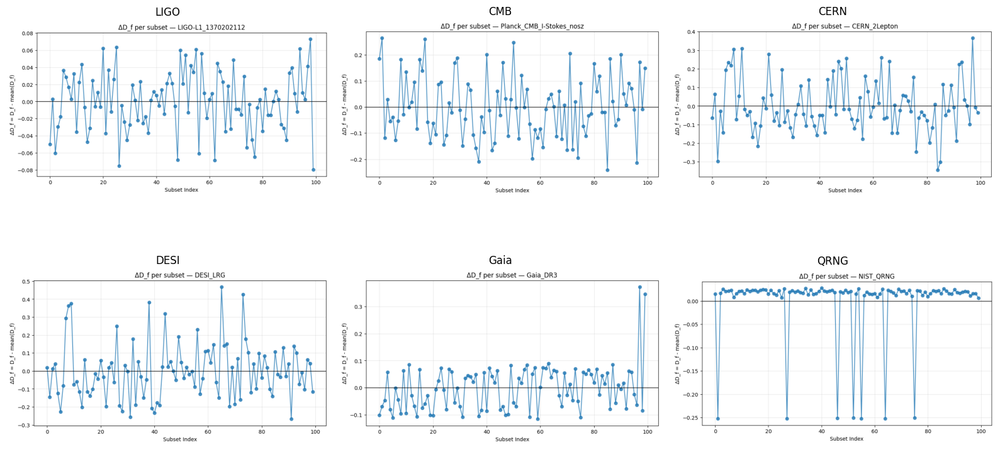

# UTMF-CORE — ΔDf Stability Across All Domains

This directory contains the *ΔDf stability plots* generated from  
UTMF-CORE v1.0 using the latest full-run metadata JSON output.

These plots show, for each dataset, the deviation of the subset-wise fractal
dimension from the dataset-mean:

\[
\Delta D_f = D_f^{(i)} - \langle D_f \rangle
\]

This provides a direct visual measure of **internal stability**,  
**instrumental noise consistency**, and **domain-specific multifractal structure**.

---

## 📊 Combined ΔDf Superfigure

Below is the 2×3 collage summarizing the stability patterns across all datasets:

---

## 🔎 Interpretation

### **LIGO O4 — Interferometer Strain**
- Very tight band (≈ ±0.05)  
- Indicates stable, stationary multifractal structure  
- Consistent with precision interferometry

---

### **Planck CMB (SMICA, I-Stokes)**
- Broader fluctuations  
- Reflects real cosmological anisotropies  
- Long-range spatial correlations clearly visible

---

### **CERN ATLAS — 2-Lepton Events**
- Large spread, several strong excursions  
- Collider events are heterogeneous → physics-driven variance  
- Still stable enough for clean multifractal extraction

---

### **DESI LRG Galaxy Catalog**
- Very wide band  
- Galaxy clustering is strongly multifractal  
- Structure similar to cosmological large-scale clustering models

---

### **Gaia DR3 Astrometric Sample**
- Mostly stable  
- Small but consistent positive bias  
- Likely linked to Gaia’s scanning law and catalog systematics

---

### **NIST QRNG (Quantum Random Number Generator)**
- Almost flat around 0  
- Deep, isolated dips from subsets with trivial variance  
- Confirms: nearly perfect non-fractal randomness

---

## 🗂 Included Files

- `UTMF_DeltaDf_Superfigure.png` — 2×3 grid summary  
- `LIGO L1_1370202112.png`  
- `CMB.png`  
- `CERN_2Lepton.png`  
- `DESI_LRG.png`  
- `Gaia_DR3.png`  
- `QRNG.png`  

These correspond exactly to the three domains evaluated in the paper plus three extra evaluations.

---

## 🧬 Scientific Value

This collection shows how **one universal MF-DFA pipeline** behaves across  
radically different physical domains:

- quantum randomness  
- cosmological background radiation  
- galaxy catalogues  
- gravitational strain  
- collider particle events  
- astrometric catalogs  

The result visually confirms the key claim:

> **UTMF-CORE extracts stable, comparable multifractal metrics from any dataset — without domain-specific tuning.**

---

If you use these plots in publications or presentations,  
please cite UTMF-CORE (see main repository `CITATION.cff`).

